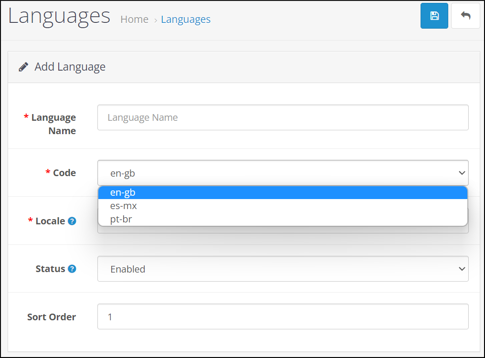
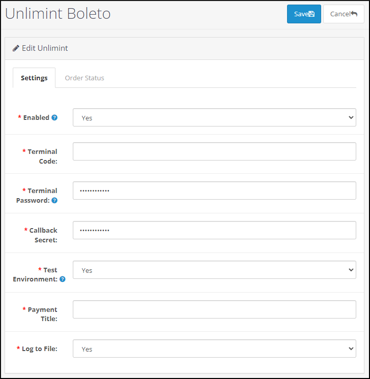
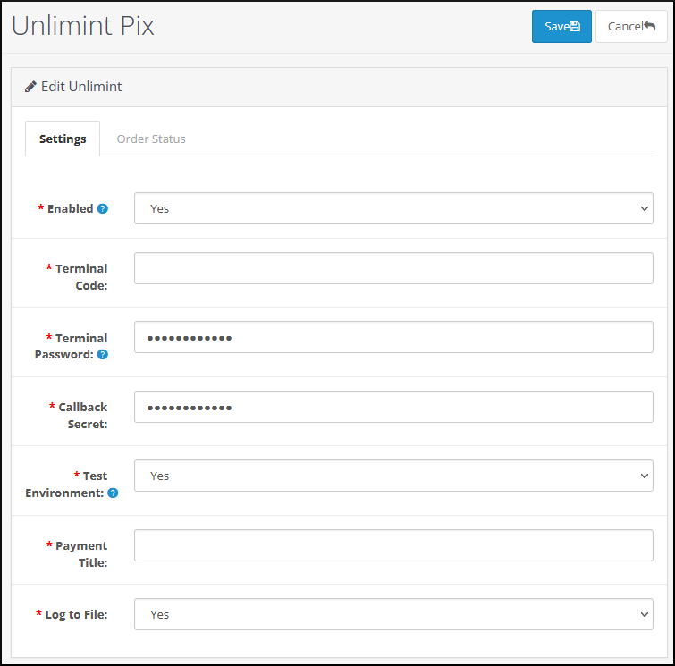
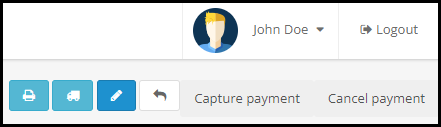
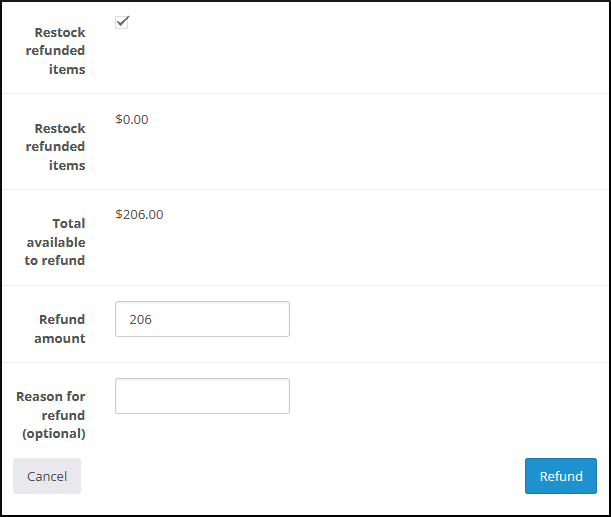
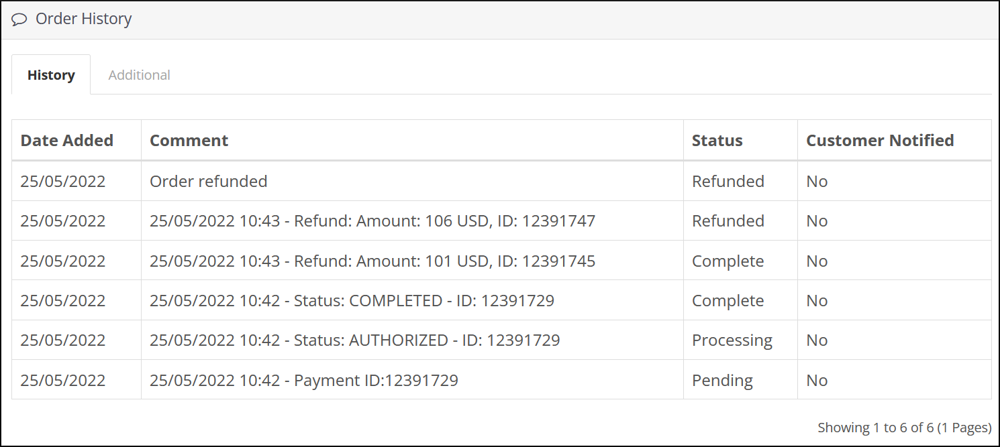

# Unlimint Opencart plugin

**Table of Contents**

 * [Overview](#Overview)
   * [Requirements](#Requirements)
   * [Supported payment methods](#Supported_payment_methods)
   * [Supported languages](#Supported_languages)
 * [Installation](#Installation)
 * [Unit tests (optional)](#Unit_tests)
 * [Configuration](#Configuration)
   * [Basic settings](#Basic_settings)
     * [Payment methods settings](#Payment_methods_settings)
         * [Unlimint Credit Card](#Unlimint_Credit_Card)
         * [Unlimint Boleto](#Unlimint_Boleto)
         * [Unlimint Pix](#Unlimint_Pix)
     * [Order status tab settings (mapping of the order statuses)](#Order_status_tab)
   * [Payment notification configuration](#Payment_notification_configuration)     
 * [Supported post-payment operations](#Supported_post-payment_operations)
   * [Cancellation (void) / Capture of the payment](#Cancellation_capture)
     * [Capture of the payment](#Capture_of_the_payment)
     * [Cancel (void) the payment](#Cancel_payment)
   * [Refund the payment](#Refund_the_payment)

## Overview

**Unlimint Opencart** engine plugin allows merchants to make payments and installment payments using the Opencart platform, as well as preauthorized payments plugin supports cancellation (void), capture of the payment or installment payment.

### Requirements

**Unlimint Opencart** plugin is open-source and supports:

 * The Opencart engine (version 3.0.3.8)
 * PHP 7.4, PHP 8.* and all other requirements regarding official [Opencart recommendations](https://docs.opencart.com/requirements/)

### Supported payment methods

**Unlimint Opencart** plugin supports the following payment methods:

 * Unlimint Credit Card
 * Unlimint Boleto
 * Unlimint Pix

### Supported languages

**Unlimint Opencart** plugin supports the following languages:

 * English
 * Spanish
 * Portuguese

## Installation

Installation process explains how to install the **Opencart plugin**:

1. Download the latest version of Opencart plugin from Unlimint's GitHub [repository](https://github.com/cardpay/opencart-plugin).

2. Go to the required root directory.

3. Upload the plugin folder to the root directory. As a result, the required plugin directory should be presented.

**Unlimint Opencart** plugin was successfully installed and enabled.

## Unit tests (optional)

For execution of unit tests for Opencart plugin, run the command in the console:

 `phpunit ./tests`
   
This command executes all tests from **tests/unit** catalogue.

## Configuration

Configuration process explains how to set up and configure the Opencart plugin to accept payments in supported payment methods.

### Basic settings

Begin with the following basic settings:

1. Log in to Admin panel of the **Unlimint Opencart** plugin (using admin credentials).

2. Navigate to **Extensions** > **Extensions** > **Payments** (payment methods settings).

3. Select the required payment method.

#### Payment methods settings

It is necessary to enable payment methods in the Opencart plugin:

 * Unlimint Credit Card
 * Unlimint Boleto
 * Unlimint Pix

Each supported payment method includes the **Settings** tab and the **Order status** tab.

**Order status** tab displays the required _mapping of transaction and order statuses_ and allows the selection of the following order statuses:

 * Canceled
 * Canceled Reversal
 * Chargeback
 * Complete
 * Denied
 * Expired
 * Failed
 * Pending
 * Processed
 * Processing
 * Refunded
 * Reversed
 * Shipped
 * Voided

First, access the requested methods and enable them by **Unlimint support** (a part of merchant onboarding process - see [here](https://www.unlimint.com/integration/)).

##### Unlimint Credit Card

To enable payments via **Unlimint Credit Card**, do the following steps:

 * Go to **Unlimint Credit Card** payment method and click **Edit**.

 * Switch on **Enabled** for **Unlimint Credit Card** payment method. 

 

 * Set **Terminal code**, **Terminal password**, **Callback secret** values - it should be merchant credentials in Unlimint APIv3 for this payment method (how to obtain credentials see [here](https://www.unlimint.com/integration/)).

 * **Test environment**:
   * Set to **Yes** for Sandbox environment (for test purposes).
   * Set to **No** for Production environment.

 * **Payment title** - fill in the name of the payment method, will be presented for the customer in checkout.

 * **Capture payment**:
   * Set to **Yes** for completion payment automatically (one phase payment).
   * Set to **No** for two phases payment: the amount will not be captured but only blocked.

With **No** option selected, payments will be captured automatically in 7 days from the time of creating the preauthorized transaction.

In installment case with **No** option selected installments will be declined automatically in 7 days from the time of creating the preauthorized transaction.

 * **Installment enabled:** - this setting enables installment payments possibility.
   * Set to **Yes** - installment payments are enabled, number of installments are available for selection in payment form, it's possible to split payment to 2-12 installments, each installment in 30 days period.
   * Set to **No** - installment payments are disabled.
 * **Ask CPF** - set to **Yes** if **CPF (Brazilian Tax Id)** is required for the customer in checkout.
 * **Dynamic Descriptor** - short description of the service or product, see `dynamic_descriptor` API field in [API documentation](https://integration.unlimint.com/#PaymentRequestPaymentData).
 * **Log to file** - Opencart plugin system log setting, this log file contains the plugin debug information, communication errors between plugin front-end and back-end. By default, it's set to **Yes**. If it will be set to **No** - the log file won't be created. 

Click **Save** or **Cancel** in order to save or cancel the preferred settings.

##### Unlimint Boleto

To enable payments via **Unlimint Boleto** payment method, do the following steps:

 * Go to **Unlimint Boleto** payment method and click **Edit**.

 

 * Switch on **Enabled** for **Unlimint Boleto** payment method.

 

 * Set **Terminal code**, **Terminal password**, **Callback secret** values - it should be merchant credentials in Unlimint API v3 for this payment method (how to obtain credentials see [here](https://www.unlimint.com/integration/)).

 * **Test environment**:
   * Set to **Yes** for Sandbox environment (for test purposes).
   * Set to **No** for Production environment.

 * **Payment title** - fill in the name of the payment method, will be presented for the customer in checkout.
 
 * **Log to file** - Opencart plugin system log setting, this log file contains the plugin debug information, communication errors between plugin front-end and back-end. By default, it's set to **Yes**. If it will be set to **No** - the log file won't be created. 

Click **Save** or **Cancel** in order to save or cancel the preferred settings.

##### Unlimint Pix

To enable payments via **Unlimint Pix** payment method, switch on **Enabled** for this payment method and do the following steps:

 * Go to **Unlimint Pix** payment method.
 

 * Set **Terminal code**, **Terminal password**, **Callback secret** values - it should be merchant credentials in Unlimint API v3 for this payment method (how to obtain credentials see [here](https://www.unlimint.com/integration/)).
 * Test environment:
    * Set to **Yes** for Sandbox environment (for test purposes).
    * Set to **No** for Production environment.

 * **Payment title** - fill in the name of the payment method, will be presented for the customer in checkout.

 * **Log to file** - the setting of the Opencart plugin system log, this log file contains the plugin debug information, communication errors between plugin front-end and back-end. By default, it's set to **Yes**. If it will be set to **No** - log file will not be created.

Click **Save** or **Cancel** in order to save or cancel the preferred settings.

The selected payment methods are successfully enabled in the checkout.

#### Order status tab settings (mapping of the order statuses)

Mapping of the order statuses is set by default and must be changed _only_ if Merchants have custom order statuses flow (not recommended to change).

**Flow of the statuses** is **unique** for each supported payment method in plugin. If Merchants change the status flow for **Unlimint Credit Card**, the status flow for the **Unlimint Boleto** and **Pix** payment methods is not changed.

If it is required to see or change **Order mapping** statuses for **Unlimint Credit Card** - go to **Unlimint Credit Card** and choose **Order status** tab.

Refer to the **Order status** tab in order to see or change the Order mapping statuses for **Unlimint Boleto**.

Refer to the **Order status** tab in order to see or change the Order mapping statuses for **Unlimint Pix**.

### Payment notification configuration

This process explains how to set up Order statuses for payment notifications:

1. Log in to the Unlimint’s [Merchant account](https://sandbox.cardpay.com/ma) with Merchant credentials (obtaining of merchant credentials is a part of merchant onboarding process - see details [here](https://www.unlimint.com/integration/)).
2. Go to **Wallet Settings** and click on the Wallet's ID (Settings / Wallet settings / choose specific wallet id / Callbacks / JSON callback URL).
3. Fill in the JSON Callback URL field with:

`https://<merchant_domain>/index.php?route=extension/payment/ul_general/callback` where _<merchant_domain>_ is website domain.

The notification statuses have been successfully configured.

## Supported post-payment operations

Unlimint Opencart plugin supports the following post-payment operations:

 * Cancellation (void) / Capture of the preauthorized payment;
 * Refund payment.

### Cancellation (void) / Capture of the payment

Cancellation (void) / capture of the payment only works for **Unlimint Credit Card** payment method.

It's available only for orders which were processed by a certain payment method configuration (**Capture payment** is set to **No**). 

If **Capture payment** is set to **Yes** - an order will be completed without any user actions in Opencart Admin Panel.

#### Capture of the payment

For Capture of the preauthorized payment, navigate to **Sales** > **Orders** section and click **View** button of the required payment.

Then click **Capture payment** button, which is available only for preauthorized payments.

Click **OK** in the pop-up window, which requires the approval and says **Are you sure you want to capture the payment?**

After the successful processing of the operation the order status will change to **Complete** and will be displayed in the **Order history** section.

#### Cancel (void) the payment

For cancel (void) the payment, navigate to **Unlimint Credit Card** and choose the **Order Status** tab for *Order status when payment is voided*, then click **Cancel payment**.

Click **OK** in the pop-up window, which requires the approval and says **Are you sure you want to cancel the payment?**

After the successful processing of the operation the order status will change to **Canceled** and will be displayed in the **Order history** section.

### Refund the payment

**Refund** operation is supported only for payments (not installment payments) with payment method **Unlimint Credit Card**.

For creating a **Refund payment** navigate to **Orders** and choose any **Order** in status **Complete**.

Click the **View** button and proceed to the detailed order information. Then click the **Edit** button and click the **Refund payment** button.

Fill in the amount of the refund and click the **Refund** button after the refund amount calculation is complete.

Confirm the operation in the presented refund confirmation pop-up window.

After successful full refund, the status of the order is changed to **Refunded**.

